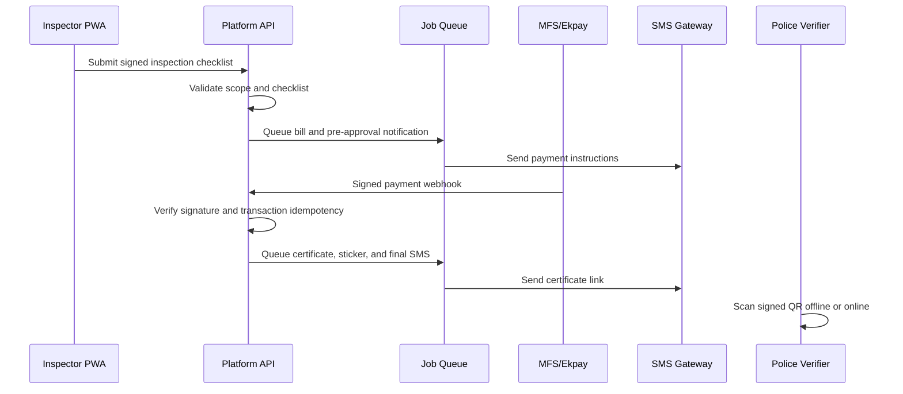

# Product & Technical Specification

## 1. Purpose

Build a government-authority platform that certifies e-rickshaw fitness, collects the statutory fee through approved Mobile Financial Service (MFS) channels, issues verifiable certificates, and lets traffic police validate a vehicle in the field with or without mobile data.

The system must support initial deployment at BUET and Polytechnic inspection hubs, followed by district-level expansion.

## 2. Goals and success measures

| Goal | Measure |
| --- | --- |
| Digitize inspections | At least 95% of completed inspections have a digital checklist and inspector audit record. |
| Make payment traceable | Every paid certificate is linked to exactly one verified provider transaction. |
| Enable roadside checks | A valid QR sticker verifies in under 3 seconds online and under 1 second offline on a supported device. |
| Operate in poor connectivity | Inspectors can complete and safely sync offline inspections with no duplicate submissions. |
| Reduce fraud | Invalid, altered, expired, revoked, or out-of-zone certificates are distinguishable during verification. |

## 3. Scope

### In scope

- Inspector PWA for vehicle registration, checklist-based inspection, offline capture, and sync.
- Admin portal for users, zones, inspection templates, fee rules, exceptions, and reports.
- Owner notifications by SMS.
- Bill generation, MFS payment reconciliation, and webhook processing.
- Certificate PDF, public verification page, printed sticker payload, and signed QR code.
- Police verifier app or web/native scanner with offline signature validation.
- RBAC, geography restrictions, immutable audit trail, monitoring, and operational reporting.

### Out of scope for the first release

- A consumer owner app beyond a public certificate page.
- Hardware procurement, sticker printer drivers, and telco/MFS commercial agreements.
- National identity verification and vehicle registration-system integration, unless an authoritative API is provided.
- Automated visual or mechanical diagnosis.

## 4. Users and permissions

| Role | Primary permissions |
| --- | --- |
| Inspector | Register/search vehicles in assigned geography; perform inspections; submit or sync drafts; view own records. |
| Hub supervisor | Review exceptions, reassign inspections, manage local stock/printers, view hub reports. |
| District administrator | Manage users and hubs in assigned district; view district reports; approve defined overrides. |
| Central administrator | Manage zones, fee schedules, templates, provider configuration, signing policy, and national reports. |
| Finance operator | View bills, payment statuses, reconciliation exceptions, and provider settlement reports. |
| Traffic police verifier | Scan and view the minimum verification result; no editing or owner contact details. |
| Owner/public visitor | View a certificate’s limited public status through a short link or QR scan. |
| System worker | Non-human service account limited to queued jobs and provider callbacks. |

All human access requires authenticated accounts. Privileged roles require MFA. Authorization is checked both at the API endpoint and against the user’s assigned geographic scope.

## 5. Core business workflow

1. An inspector registers or selects a rickshaw and completes the active checklist.
2. The app validates required fields locally, saves the submission locally when offline, and synchronizes later using an idempotency key.
3. The server revalidates permissions and checklist rules. A passing result moves the rickshaw to `pre_approved`; a failing result remains `failed` with recorded reasons.
4. A 6–8 digit bill ID and a 48-hour payment expiry are created. The owner receives payment instructions by SMS.
5. The MFS provider posts a signed callback. The platform verifies the signature, provider transaction ID, bill, amount, currency, and expiry before accepting it.
6. A successful payment moves the rickshaw to `certified`, creates a certificate, signs its QR payload, and queues certificate PDF/sticker/SMS work.
7. Police scan the sticker. The verifier checks the offline signature and expiry; when online it also queries live status for revocation and current details.

## 6. Functional requirements

### 6.1 Vehicle and owner record

- Capture chassis number, motor number, owner phone, district, zone, vehicle identifier/plate where applicable, and supporting photos where policy permits.
- Enforce a normalized chassis number and prevent duplicate active vehicles.
- Keep a full change history; do not overwrite identifiers without an authorized correction workflow.
- Mask owner phone numbers in all verifier and most administrative views.

### 6.2 Inspections

- Checklist templates are versioned, configurable by vehicle category and effective date, and persisted with every inspection submission.
- Each check has a value, pass/fail/NA outcome, optional evidence, and required reason when failed.
- An inspection has `draft`, `submitted`, `passed`, `failed`, `voided`, or `superseded` status.
- A submitted inspection is immutable. Corrections create a linked replacement or authorized void event.
- The server records inspector identity, assigned hub, device ID where available, client time, server time, app version, and checklist version.

### 6.3 Offline PWA behavior

- Cache the current user’s assigned templates, zone data, recent vehicle index, and verifier public keys.
- Store drafts and submissions in encrypted browser storage where supported; never cache passwords or long-lived refresh tokens in service-worker caches.
- Generate a UUID idempotency key per submission. Sync retries are safe and resolve by server-issued version and conflict response.
- Display queue state: saved locally, syncing, synced, rejected, or needs review.
- Require an online authentication refresh at a configurable interval; a previously authenticated inspector may work offline only within the policy window.

### 6.4 Billing and payments

- Generate a unique numeric bill ID of 6–8 digits, associated with one rickshaw, inspection, amount, and fee-rule version.
- Default validity is 48 hours; expired bills cannot result in certificate issuance without an authorized exception process.
- Webhook processing must be idempotent by provider transaction ID and callback event ID.
- Store raw callbacks encrypted/restricted for support and audit, with redaction in logs.
- Handle paid, failed, reversed/refunded, expired, disputed, and reconciliation-required states.

### 6.5 Certificates and QR stickers

- Generate certificate number, public short code, issue/expiry time, signing key ID, and an accessible PDF.
- The sticker QR contains a compact signed payload, not a database URL or owner phone number.
- Certificate renewal creates a new certificate and QR; superseded QR codes remain recognizable but report their historical status online.
- Revocation immediately affects online verification; offline scanning communicates that live revocation status was not checked.

### 6.6 Verification

- Online public verification accepts short code or QR payload and returns limited information: validity, expiry, masked chassis suffix, zone, and certificate details permitted by policy.
- The police app validates signature, payload schema, signing-key validity, and expiry without network access.
- Offline results clearly distinguish `valid signature`, `expired`, `unrecognized key`, `invalid/tampered`, and `live status unavailable`.
- Online verification checks certificate state, revocation, and zone policy in addition to signature validity.

### 6.7 Notifications and reporting

- Send configurable Bangla/English SMS templates for payment instructions, paid confirmation, certificate issuance, expiry reminders, and failure/retry notices.
- Record delivery-provider message ID, attempt count, disposition, and last error.
- Provide filtered reports by date, district, hub, vehicle status, inspector, payment state, and certificate expiry.
- Export reports subject to role and audit restrictions.

## 7. State model

| Entity | Primary states | Key transition |
| --- | --- | --- |
| Rickshaw | `pending`, `pre_approved`, `certified`, `expired`, `suspended` | `pre_approved` only after a passing inspection. |
| Payment | `unpaid`, `paid`, `expired`, `failed`, `reversed`, `reconciliation_required` | `paid` only from a verified callback or approved reconciliation. |
| Certificate | `issued`, `active`, `expired`, `revoked`, `superseded` | `active` only after payment finality policy is met. |
| SMS | `queued`, `sent`, `delivered`, `failed`, `dead_letter` | Retry transient failures with bounded attempts. |

## 8. Non-functional requirements

- Availability: 99.5% monthly API availability during initial rollout, excluding announced maintenance.
- Performance: p95 authenticated API response below 500 ms under agreed pilot load; public verification below 300 ms with warm cache.
- Scale target: 500 concurrent inspector sessions, 2,000 verification requests/minute burst, and 100,000 active vehicle records; validate final capacity in load tests.
- Recovery: daily tested backups; RPO of 15 minutes and RTO of 4 hours for production.
- Accessibility: WCAG 2.1 AA for the web interface; Bangla-first labels with English support.
- Observability: structured logs, metrics, traces for critical flows, health checks, alerting, and searchable audit events.

## 9. Acceptance criteria for pilot release

- An inspector can complete a passing inspection online and offline, with an offline submission syncing exactly once.
- A test MFS callback creates exactly one successful payment and certificate, even if delivered repeatedly.
- The certificate QR validates with no network on a clean police verifier installation.
- Tampering with any QR payload field makes offline validation fail.
- An expired, revoked, or invalid certificate is accurately represented online.
- Users cannot read or write records outside their authorized geographic scope.
- Audit logs show who, what, when, source IP/device metadata, and before/after values for privileged actions.
