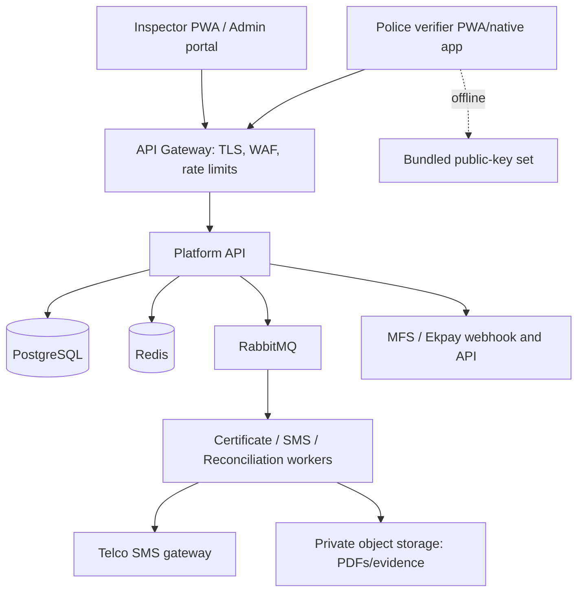

# Architecture, Data, API & Security Design

## 1. Recommended architecture

Start with a modular monolith plus asynchronous workers. It delivers the requested domains quickly while avoiding the operational overhead of multiple independently deployed services. Each module has a dedicated interface and queue contract, allowing later extraction of payment, notification, or certificate workloads if justified by measured load.



### Components

| Component | Responsibility |
| --- | --- |
| API gateway | TLS 1.3 termination, WAF rules, request IDs, per-route/IP limits, CORS, and gateway authentication enforcement. |
| Platform API | Identity, RBAC, geographic authorization, vehicle registry, inspections, bills, certificates, public verification, and admin functions. |
| Worker processes | Consume outbox events to render PDFs, sign QR payloads, dispatch SMS, retry failures, and reconcile providers. |
| PostgreSQL | System of record, transactional outbox, audit records, and row-level or application-enforced geographic isolation. |
| Redis | Rate limits, short-lived sessions/tokens where appropriate, caching of public verification, distributed locks, and throttling. |
| RabbitMQ | Durable asynchronous command/event delivery with dead-letter queues. |
| Object storage | Private evidence and certificate PDF storage with time-limited download URLs. |

Deploy separate development, staging, and production environments. Store configuration and keys in a managed secret store, never in source control. Run at least two API instances and two workers in production once the pilot stability target is reached.

## 2. Data design

Use UUID primary keys, UTC timestamps, `timestamptz`, and `created_at`/`updated_at` on mutable tables. Use `citext` for normalized identifiers where appropriate; normalize chassis/motor formats in application code. Add `version` integers to mutable records for optimistic concurrency.

### Core tables

| Table | Essential fields |
| --- | --- |
| `users` | `id`, `phone_or_email`, `status`, `mfa_enabled`, `last_login_at` |
| `roles`, `user_roles`, `user_geographies` | Role assignments and district/upazila/zone scopes. |
| `rickshaws` | `id`, `chassis_number`, `motor_number`, `owner_phone_encrypted`, `district_id`, `zone_id`, `status`, `version` |
| `inspection_templates` | `id`, `version`, `vehicle_type`, `schema_json`, `effective_from`, `effective_to`, `active` |
| `inspections` | `id`, `rickshaw_id`, `inspector_id`, `hub_id`, `template_id`, `checklist_data`, `result`, `status`, `submitted_at`, `client_timestamp` |
| `bills` | `id`, `bill_code`, `rickshaw_id`, `inspection_id`, `amount_paisa`, `currency`, `expires_at`, `status`, `fee_rule_version` |
| `payments` | `id`, `bill_id`, `provider`, `provider_transaction_id`, `amount_paisa`, `status`, `paid_at`, `callback_event_id` |
| `certificates` | `id`, `certificate_number`, `rickshaw_id`, `qr_hash`, `key_id`, `issued_at`, `expires_at`, `status`, `short_code` |
| `certificate_revocations` | `id`, `certificate_id`, `reason_code`, `revoked_by`, `revoked_at` |
| `notification_jobs` | `id`, `type`, `recipient_encrypted`, `payload`, `status`, `attempts`, `provider_message_id` |
| `audit_events` | `id`, `actor_id`, `action`, `entity_type`, `entity_id`, `before_json`, `after_json`, `ip`, `device_id`, `occurred_at` |
| `outbox_events` | `id`, `type`, `aggregate_type`, `aggregate_id`, `payload`, `occurred_at`, `published_at`, `attempts` |

### Constraints and indexes

- Unique normalized `rickshaws.chassis_number`; allow an authorized merge workflow rather than silent duplicates.
- Unique `bills.bill_code` among unexpired bills, and unique `payments(provider, provider_transaction_id)`.
- Unique `certificates.short_code`, certificate number, and QR hash.
- Index `rickshaws(district_id, zone_id, status)`, `inspections(rickshaw_id, submitted_at desc)`, `bills(status, expires_at)`, and `certificates(status, expires_at)`.
- Create outbox events inside the same database transaction as the state change that produced them.

### Data retention and privacy

- Encrypt owner phone numbers and sensitive callback bodies at rest; use application-level envelope encryption for fields requiring stronger access controls.
- Do not put PII in QR payloads, logs, SMS provider metadata, or public verification responses.
- Define retention schedules with the authority’s legal and records-management teams before production; retain audit logs longer than routine operational logs.
- Implement subject-data export/correction only as required by applicable law and authority policy, preserving statutory audit evidence.

## 3. API design

All APIs are versioned below `/api/v1`, use JSON, return a request ID, and expose an OpenAPI 3.1 contract. Authenticated writes require `Idempotency-Key`; responses use standard HTTP statuses and a stable error schema.

```json
{
  "error": {
    "code": "OUT_OF_SCOPE",
    "message": "The selected zone is outside your assignment.",
    "request_id": "01J..."
  }
}
```

### Key endpoints

| Method | Endpoint | Purpose |
| --- | --- | --- |
| `POST` | `/auth/login` | Start authenticated session; MFA challenge where required. |
| `POST` | `/auth/refresh` | Rotate refresh token/session. |
| `GET` | `/rickshaws?chassis_number=` | Search an authorized vehicle. |
| `POST` | `/rickshaws` | Register a vehicle. |
| `POST` | `/inspections` | Submit inspection or offline-sync record. |
| `GET` | `/inspections/templates/current` | Fetch current assigned templates for PWA cache. |
| `GET` | `/bills/{billCode}` | Authorized bill status. |
| `POST` | `/webhooks/mfs/{provider}` | Provider callback; mTLS/IP allowlist and signature validation. |
| `GET` | `/certificates/{shortCode}` | Authorized certificate detail/download authorization. |
| `GET` | `/public/verify/{shortCode}` | Limited public online verification. |
| `POST` | `/public/verify/qr` | Validate/display QR payload online. |
| `GET` | `/verifier/keys` | Public signing-key manifest for verifier app updates. |
| `POST` | `/admin/certificates/{id}/revoke` | Privileged revocation with reason and dual-approval policy if required. |

Webhook acknowledgement must occur only after durable persistence. If downstream processing fails, return a retryable error only when the provider contract allows it; otherwise retain the event and reconcile asynchronously.

## 4. QR and offline-verification design

Use Ed25519. It offers compact public keys and signatures and is well suited to offline verification. Private signing keys remain in an HSM or managed KMS signing service; verifier apps contain only public keys.

Suggested payload before canonical CBOR encoding:

```json
{
  "v": 1,
  "kid": "2026-q3-01",
  "cid": "CERT-2026-00012345",
  "ch": "8821",
  "zone": "DHK-N-04",
  "iat": 1780000000,
  "exp": 1811536000,
  "nonce": "random-96-bit-value"
}
```

Encode as `base45(CBOR(payload) || Ed25519_signature)`, optionally with a short prefix such as `ERF1:`. QR payloads contain only a non-sensitive chassis suffix, not owner data. A signed key manifest includes `kid`, Ed25519 public key, activation date, and retirement date. Apps update it online, retain previously valid keys until their certificate population expires, and show key-list freshness.

Offline validation verifies format, canonical decode, signature, key activation window, and certificate expiry against device time. Device time can be manipulated, so the app must warn when the clock is implausible and make clear that offline mode cannot check revocation. Online validation is authoritative for revocation and current status.

## 5. Security controls

| Area | Required control |
| --- | --- |
| Identity | OIDC-compatible identity layer, MFA for privileged roles, short access tokens, refresh-token rotation, forced logout on compromise. |
| Authorization | RBAC plus district/upazila/zone ABAC checks in every data query and command. Deny by default. |
| API protection | TLS 1.3, WAF, strict CORS, schema validation, per-principal/IP rate limits, body-size limits, request IDs. |
| Payments | Provider-specific HMAC-SHA256 verification using constant-time comparison, timestamp/replay window, IP/mTLS controls where supported, idempotency constraints, reconciliation. |
| Signing keys | HSM/KMS storage, key IDs and rotation, split duties for key administration, no private key export. |
| Data | Encryption in transit and at rest, PII field encryption, least-privilege database accounts, backups encrypted and restoration-tested. |
| Audit | Append-only audit stream for privileged actions and state transitions; logs protected from ordinary application users. |
| Supply chain | Dependency scanning, SBOM, pinned CI actions/images, secret scanning, code review, staged releases. |
| Operations | Alerts for webhook signature failures, duplicate payment attempts, certificate issuance spikes, queue backlog, authentication anomalies, and backup failures. |

Do not rely solely on an HMAC signature claim from a provider: validate the exact signed bytes, provider credentials, timestamp, transaction status, amount, bill mapping, and duplicate status. Confirm the final provider contract during integration.

## 6. Deployment and operations

- Package API and workers in containers; use infrastructure as code for all environments.
- Run database migrations in CI/CD with backward-compatible expand/migrate/contract patterns.
- Publish structured JSON logs with PII redaction; connect metrics and traces to a central observability platform.
- Back up PostgreSQL with point-in-time recovery and test a restore monthly. Store object-storage versions and lifecycle policies.
- Use a transactional outbox publisher and dead-letter queues; surface retry and DLQ handling in the operator portal.
- Release behind feature flags by district/hub and retain rollback capability for application versions and templates.
